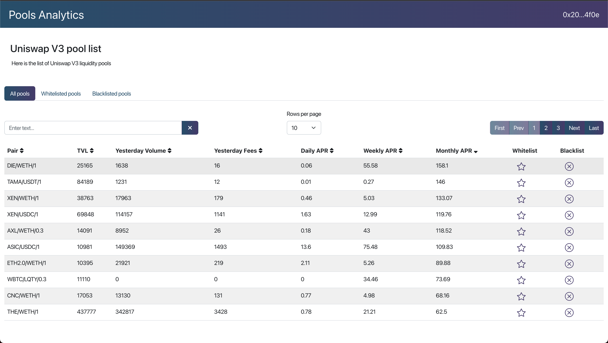

# Pool Statistics

> React.js application that fetches Uniswap V3 pools from theGraph and allow users to whitelist or blacklist them to make a proper analysis on which pools to invest in.
> 
> It also adds daily, weekly and monthly APRs for each pool. Something that does not yet exist in any DAPP (or almost any at the time of writing).

## Live version
Go [here](https://danielruizc.com/projects/pool-statistics) to see it in action.


## Stack
The stack for this Application is:
* React.js for the application
* Bootstrap 5 for styles
* Web3 to connect account and sign a valid signature that API will use as an authorization of the user

## Install dependencies
```
npm install
```

## Update project private configuration
Duplicate file "config.env" to ".env" and update the values/settings to your own

## Run application
```
# Run in dev mode
npm start

# Run in production mode
npm run build
```

## Version & License
- Version: 1.0.0
- License: MIT

## Contact information
Daniel Ruiz <<druizcallado@gmail.com>>